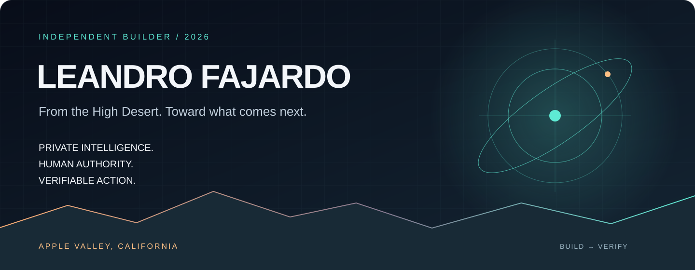

<div align="center">



# Intelligence should earn your trust.

**I’m Leandro Fajardo. I build and explore systems that connect AI intent to accountable action.**

Apple Valley, CA · Independent builder · 2026

[Explore the engineering](#01--the-engineering) &nbsp; / &nbsp; [See the bigger vision](#02--the-bigger-vision) &nbsp; / &nbsp; [Build with me](#04--the-next-move)

</div>

---

## The throughline

An agent operating a device. A printer producing a part. An AI helping create a work. A retrofit changing a space.

Each raises the same questions:

**Who authorized the change? What are the limits? What proves the result?**

That is the thread connecting my engineering experiments and venture concepts. I call it **Trusted Transformation Infrastructure**: clear authority, bounded execution, and outcomes people can inspect.

> **Build with boundaries. Verify outcomes.**

## 01 / The engineering

My engineering work explores **AI agents, native Apple workflows, and developer automation**. The focus is the path from a request to a useful, checkable result.

| Explore | What it investigates |
| :--- | :--- |
| [**caRINA →**](https://github.com/leandro4979-hub/caRINA) | Controlled agent execution and authorization |
| [**Applications →**](https://github.com/leandro4979-hub/Applications) | Application experiments and prototypes |
| [**neuralforge →**](https://github.com/leandro4979-hub/neuralforge) | AI and engineering experimentation |
| [**Openai →**](https://github.com/leandro4979-hub/Openai) | OpenAI-related development work |

**Design priorities:** private processing where practical, explicit permissions, native interfaces, observable execution, and recovery when something fails.

These repositories are a working lab. Check each project’s documentation for its implementation and current status.

## 02 / The bigger vision

The same control model extends beyond software. Three original venture concepts explore what happens when physical and creative transformations carry clear rules and evidence.

### MAKE NEARBY
#### Hyper-Local Micro-Manufacturing
Modular local production hubs for customized, low-volume goods.

**First proposed test:** two qualified local printers, one replacement part. Compare lead time, quality, landed cost, and repeatability—with a traceable QA record.

### CREATE WITH CREDIT
#### Ethical Algorithmic Artistry
Human + AI cultural creation with explicit permission, contributor identity, attribution, and provenance.

**First proposed test:** one image, audio, or text artifact with a signed manifest documenting sources, permissions, and contributors.

### UPGRADE WHAT EXISTS
#### Adaptive Infrastructure Retrofits
Modular upgrades that bring new functionality to existing buildings, including kinetic facades.

**First proposed test:** one reversible retrofit in a bounded zone. Document design constraints, installation, inspection, and before/after functionality.

## 03 / The standard of proof

```text
DEFINE THE ASSET
      ↓
ESTABLISH AUTHORITY
      ↓
SET THE BOUNDARIES
      ↓
EXECUTE THE CHANGE
      ↓
VERIFY THE OUTCOME
```

| Portfolio stage | Current position |
| :--- | :--- |
| **Concepts** | Three venture theses and operating models defined |
| **Pilot plans** | Three initial test paths proposed |
| **Real-world validation** | Pending the first completed pilot |

**The next milestone:** one bounded pilot, measurable success criteria, and a durable record of what actually happened.

## 04 / The next move

**Bring one problem worth testing.**

There are two ways in:

| If you have... | Start here | Goal |
| :--- | :--- | :--- |
| A problem, observation, hypothesis, or product direction that still needs evidence | [**Signal an idea →**](https://github.com/leandro4979-hub/Leandro4979-hub/issues/new?template=idea.yml) | Clarify the problem, evidence, user, smallest test, and next learning step |
| A real use case with a contribution, authority, boundaries, and success criteria | [**Build together →**](https://github.com/leandro4979-hub/Leandro4979-hub/issues/new?template=collaboration.yml) | Define a bounded collaboration or pilot that can produce inspectable proof |

The intended path is simple:

```text
IDEA
  ↓
EVIDENCE
  ↓
BOUNDED TEST
  ↓
COLLABORATION / PILOT
  ↓
VERIFIED OUTCOME
```

I’m especially interested in:

- **Pilot partners:** bring a real use case, constraints, and success criteria.
- **Builders:** help implement, secure, instrument, or integrate the test.
- **Evaluators:** challenge assumptions and improve the measurement.
- **Design partners:** improve product, UX, accessibility, and workflow quality.
- **Research partners:** bring technical or applied evidence that changes the design.

An idea issue is **exploration, not a commitment**. A collaboration issue is the point where ownership, authority, boundaries, contribution, and proof need to become explicit.

<div align="center">

### [Let’s build the first proof →](https://github.com/leandro4979-hub/Leandro4979-hub/issues/new?template=collaboration.yml)

[Explore the repositories](https://github.com/leandro4979-hub?tab=repositories) · [Signal an idea](https://github.com/leandro4979-hub/Leandro4979-hub/issues/new?template=idea.yml)

---

**LEANDRO FAJARDO**  
Apple Valley, California · 2026

*From the High Desert. Toward what comes next.*

<sub>Original venture concepts and Trusted Transformation Infrastructure framing by Leandro Fajardo.</sub>

</div>
