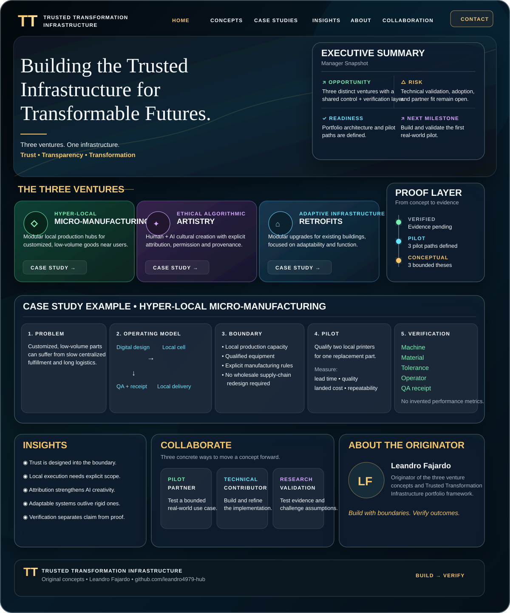

# Leandro Fajardo

### Build with boundaries. Verify outcomes.

**What if every transformation came with proof?**

I’m exploring systems that make it clear **who can act, what can change, and how we know it worked**—across local manufacturing, AI-assisted creativity, and adaptable buildings.

[Explore the concepts](#three-ideas-one-standard) · [Build a pilot with me](#help-turn-a-concept-into-evidence) · [Engineering lab](#engineering-lab)

---

## Three ideas. One standard.

**Trusted Transformation Infrastructure** is the shared model behind this portfolio:

> An asset. An authorized actor. Clear rules. A controlled change. A result you can check.

### 01 / Make it nearby
**Hyper-Local Micro-Manufacturing**

Explore modular local production hubs for customized, low-volume goods.

**First pilot:** qualify two local printers for one replacement part. Compare lead time, quality, landed cost, and repeatability. Record the material, machine, operator, and QA result.

**The question:** can a small local production cell deliver a useful part with a traceable quality record?

### 02 / Create with credit
**Ethical Algorithmic Artistry**

Explore human + AI cultural creation with explicit permission, contributor identity, attribution, and provenance.

**First pilot:** create one image, audio, or text artifact with a signed provenance manifest documenting its sources, permissions, and contributors.

**The question:** can an AI-assisted work carry a clear, inspectable record of permission and credit?

### 03 / Upgrade what exists
**Adaptive Infrastructure Retrofits**

Explore modular upgrades that give existing buildings new functionality, including kinetic facades.

**First pilot:** test one reversible retrofit in a bounded zone. Document constraints, installation, inspection, and before/after functionality.

**The question:** can an existing space gain a useful capability through a bounded, reversible change?

---

## Where things stand

| Defined | Next | Evidence |
| :--- | :--- | :--- |
| Three venture concepts and operating models | Select and run the first bounded pilot | Real-world validation pending |
| Three initial pilot paths | Agree on measurable success criteria | No performance claims before results |

These are **venture concepts with proposed pilot paths**. The next milestone is a completed pilot with an outcome others can inspect.

## Why follow this work?

Follow for the decisions behind turning these concepts into testable systems: what gets built, which assumptions get challenged, and what the evidence supports.

The ideas worth sharing should be useful beyond one project:

- **Permission before action:** define who can change what.
- **Boundaries before scale:** start with one complete, measurable use case.
- **Evidence after execution:** record the outcome, including failures and limitations.

## Help turn a concept into evidence

| If you are… | A useful starting point |
| :--- | :--- |
| A **pilot partner** | Bring one real use case and help define success. |
| A **technical contributor** | Help build, secure, or instrument a pilot. |
| A **researcher or evaluator** | Challenge an assumption or propose a better measurement. |

**Have a use case?** Open an issue with the venture you’re interested in, the problem you see, and what a successful pilot would demonstrate.

**[Start a collaboration →](https://github.com/leandro4979-hub/Leandro4979-hub/issues/new?template=collaboration.yml)**

[Suggest an idea](https://github.com/leandro4979-hub/Leandro4979-hub/issues/new?template=idea.yml) · [Explore my repositories](https://github.com/leandro4979-hub?tab=repositories)

## Engineering lab

Alongside the venture concepts, I explore AI agents, Apple-platform automation, authorization, and verifiable execution.

| Project | Focus |
| :--- | :--- |
| [**caRINA**](https://github.com/leandro4979-hub/caRINA) | Controlled agent execution and authorization |
| [**Applications**](https://github.com/leandro4979-hub/Applications) | Application experiments and prototypes |
| [**neuralforge**](https://github.com/leandro4979-hub/neuralforge) | AI and engineering experimentation |
| [**Openai**](https://github.com/leandro4979-hub/Openai) | OpenAI-related development work |

---

**Original venture concepts and Trusted Transformation Infrastructure framing · Leandro Fajardo**

*Build something useful. Make the outcome checkable.*

